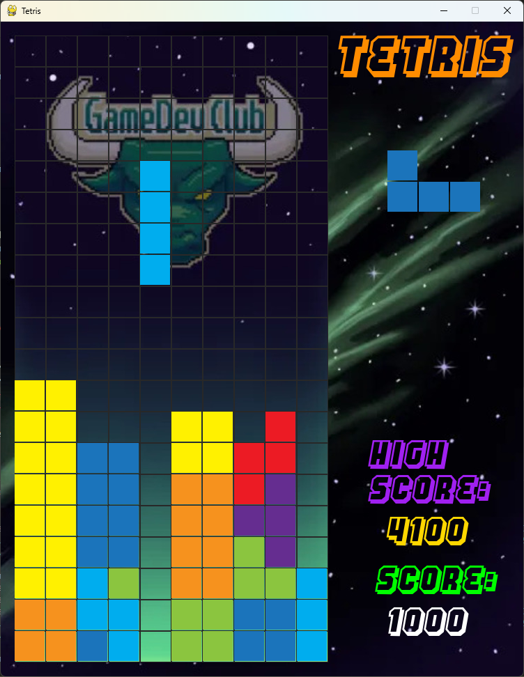
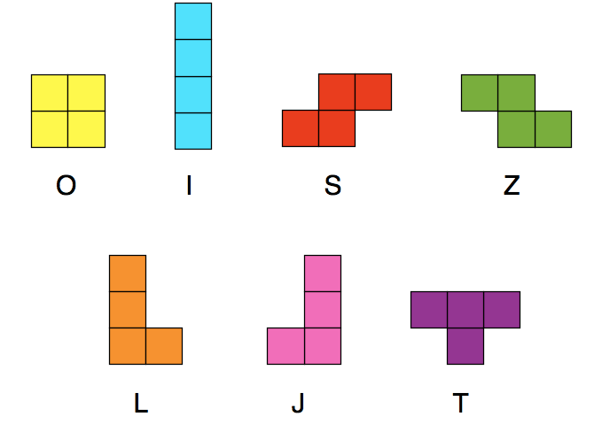

author: Jonathan Wong
summary:
id: TetrisCodeLab
tags:
categories:
environments: Web
status: Published
feedback link: https://github.com/SolaceDev/solace-dev-codelabs/blob/master/markdown/TetrisCodeLab

# Tetris Workshop GameDev Club

## What you'll learn: Overview

Make Tetris in Pygames 

> aside negative
> Warning, this codelab is more difficult than everything we have done before, and is arguably the hardest we will be doing this semester.

### Table of Content
1. Setting Play Area
1. Creating Tetrominos (Blocks)
1. Player Inputs (Moving Sideways)
1. Player Inputs (Moving down)
1. Randomizing next Tetromino 
1. Stoping Figure on bottom
1. Player Inputs (Rotation)
1. Removing Full lines (Basically finished with gameplay)
1. Modifying game window
1. Adding color to Tetrominos
1. Title and Next Block
1. Score and Feel
1. Game Over Handler (New high score)
1. <strong> Optionals </strong>
1. CONGRATS YOU MADE TETRIS 


### Image of Final product



## Setting up Pygames and Play Area

Duration: 0:07:00

### Step 1
```
import pygame
import sys
from copy import deepcopy

WIDTH, HEIGHT = 10, 20;
TILE = 45;
GAME_RES = (WIDTH * TILE, HEIGHT * TILE)

pygame.init()
screen = pygame.display.set_mode(GAME_RES)
pygame.display.set_caption("Tetris")

while True:
    screen.fill(pygame.Color("black"))

    for event in pygame.event.get():
        if event.type == pygame.QUIT:
            pygame.quit()
            sys.exit()

    pygame.display.update()
    CLOCK.tick(60)
```

### Step 2 making grid
```
pygame.init()
screen = pygame.display.set_mode(GAME_RES)
pygame.display.set_caption("Tetris")

# NEW CODE HERE
GRID = [pygame.Rect(x * TILE, y * TILE, TILE, TILE) for x in range(WIDTH) for y in range(HEIGHT)] 
```

```
for event in pygame.event.get():
        if event.type == pygame.QUIT:
            pygame.quit()
    # NEW CODE HERE
    [pygame.draw.rect(screen, (40,40,40), i_rect, 1) for i_rect in GRID]
```

## Making Tetrominos

Duration: 0:09:00

Empty 2D array for Tetromino
```
tetrominos_pos = [[(),(),(),()],
              [(),(),(),()],
              [(),(),(),()],
              [(),(),(),()],
              [(),(),(),()],
              [(),(),(),()],
              [(),(),(),()]]
```
Filled 2D array of Tetromino
```
tetrominos_pos = [[(-1,0),(-2,0),(0,0),(1,0)], # I
              [(0,-1),(-1,-1),(-1,0),(0,0)], # O
              [(-1,-1),(0,-1),(0,0),(1,0)], # Z
              [(-1,0),(0,0),(0,-1),(1,-1)], # S
              [(-1,0),(0,0),(1,0),(1,-1)], # L
              [(-1,-1),(-1,0),(0,0),(1,0)], # J
              [(-1,0),(0,0),(1,0),(0,-1)]] # T

while True:
```

```
tetrominos_pos = [[...]]

# NEW CODE HERE
tetrominos = [[pygame.Rect(x + WIDTH // 2, y +1, 1, 1) for x, y in block_pos] for block_pos in tetrominos_pos]
tetromino_rect = pygame.Rect(0,0, TILE -2, TILE -2)

tetromino = tetrominos[0]
#NEW CODE END

while True:
```
### Drawing the Tetromoino
```
# NEW CODE HERE
for i in range(4):
        tetromino_rect.x = tetromino[i].x * TILE
        tetromino_rect.y = tetromino[i].y * TILE
        pygame.draw.rect(screen, pygame.Color("white"), tetromino_rect)
# NEW CODE END

pygame.display.update()
    CLOCK.tick(60)
```


## Player Inputs (Sideways movement)

Duration: 0:10:00

```
while True:
    screen.fill(pygame.Color("black"))
    
    dir_x = 0       # NEW CODE HERE

    for event in pygame.event.get():
        if event.type == pygame.QUIT:
            pygame.quit()
            sys.exit()

        # NEW CODE HERE
        if event.type == pygame.KEYDOWN:
            if event.key == pygame.K_LEFT:
                dir_x = -1
            elif event.key == pygame.K_RIGHT:
                dir_x = 1

        for i in range(4):
            tetromino[i].x += dir_x
        # NEW CODE END
```

### Adding borders
Add new function
```
def check_borders():
    if tetromino[i].x < 0 or tetromino[i].x > WIDTH-1:
        return False
    return True
```

Because tetromino is not a real python class, we are making a psudo-class with deepcopy and, using the , load the copy when we hit it and removing the tetromino that passed the borders, disallowing it 
```
tetrominos = [[pygame.Rect(x + WIDTH // 2, y +1, 1, 1) for x, y in block_pos] for block_pos in tetrominos_pos]
tetromino_rect = pygame.Rect(0,0, TILE -2, TILE -2)

tetromino = deepcopy(tetrominos[0])     # MODIFED CODE HERE

while True:
```

```
tetromino_old = deepcopy(tetromino)
for i in range(4):
    tetromino[i].x += dir_x
    if not check_borders():
        tetromino = deepcopy(tetromino_old)
        break
```

## Making Tetrominos Fall and Downwards input

Duration: 0:09:00

```
tetrominos = [[pygame.Rect(x + WIDTH // 2, y +1, 1, 1) for x, y in block_pos] for block_pos in tetrominos_pos]
tetromino_rect = pygame.Rect(0,0, TILE -2, TILE -2)

tetromino = deepcopy(tetrominos[0])     

anim_count, anim_speed, anim_limit = 0, 60, 2000        # NEW CODE HERE

def check_borders():
```

```
anim_count += anim_speed
    if anim_count > anim_limit:
        anim_count = 0
        tetromino_old = deepcopy(tetromino)
        for i in range(4):
            tetromino[i].y += 1
```

On Down arrow down add increased drop speed
```
if event.type == pygame.KEYDOWN:
    if event.key == pygame.K_LEFT:
        dir_x = -1
    elif event.key == pygame.K_RIGHT:
        dir_x = 1
    
    # NEW CODE HERE
    elif event.key == pygame.K_DOWN:
        anim_limit = 100
```

### Re-applying anim limit on key up
```
    elif event.key == pygame.K_DOWN:
                anim_limit = 100
# NEW CODE HERE
elif event.type == pygame.KEYUP:
    if event.key == pygame.K_DOWN:
        anim_limit = 2000
```

## Making tetrominos random

Duration: 0:13:00

```
import pygame
import sys
from copy import deepcopy
from random import choice      # NEW CODE
```

```
tetrominos = [[pygame.Rect(x + WIDTH // 2, y +1, 1, 1) for x, y in block_pos] for block_pos in tetrominos_pos]
tetromino_rect = pygame.Rect(0,0, TILE -2, TILE -2)
tetromino = deepcopy(choice(tetrominos))    # MODIFIED CODE
```

### Stoping Figures that has hit bottom 

```
tetrominos = [[pygame.Rect(x + WIDTH // 2, y +1, 1, 1) for x, y in block_pos] for block_pos in tetrominos_pos]
tetromino_rect = pygame.Rect(0,0, TILE -2, TILE -2)
tetromino = deepcopy(choice(tetrominos))
# NEW CODE HERE
feild = [[0 for i in range(WIDTH)] for j in range(HEIGHT)]      
```

In Y movement Part of Code
```
for i in range(4):
    tetromino[i].y += 1

    # NEW CODE HERE
    if not check_borders():
        tetromino = deepcopy(choice(tetromins))
        break
```

modify border check
```
def check_borders():
    if tetromino[i].x < 0 or tetromino[i].x > WIDTH-1:
        return False
    elif tetromino[i].y > HEIGHT -1 or feild[tetromino[i].y][tetromino[i].x]:
        return False
    return True
```

In Y movement Part of Code
```
for i in range(4):
    tetromino[i].y += 1
    if not check_borders():
        # NEW CODE HERE
        for i in range(4):
            feild[tetromino[i].y][tetromino[i].x] = pygame.Color('white')
        # NEW CODE END
        tetromino = deepcopy(choice(tetrominos))
        break
```

```
# Drawing Feild (the bottom the tetrominos that is touching bottom)
for y, row in enumerate(feild):
    for x, col in enumerate(row):
        if col:
            tetromino_rect.x, tetromino_rect.y = x * TILE, y * TILE
            pygame.draw.rect(screen, col, tetromino_rect)

pygame.display.update()
CLOCK.tick(60)
```

## Player Input (Rotating Tetrominos)  

Duration: 0:07:00

```
rotate = False      # Create a new var

for event in pygame.event.get(): ...
    if event.type == pygame.KEYDOWN: ...
        elif event.key == pygame.K_DOWN:
            anim_limit = 100
        # NEW CODE HERE
        elif event.key == pygame.K_UP:      
            rotate = True
```

### Rotating logic
```
center = tetromino[0]
tetromino_old = deepcopy(tetromino)
if rotate:
    for i in range(4):
        x = tetromino[i].y - center.y
        y = tetromino[i].x - center.x
        tetromino[i].x = center.x - x
        tetromino[i].y = center.y + y
        if not check_borders():
            tetromino = deepcopy(tetromino_old)
            break
```

## Removing full lines (Game play basically finished)

Duration: 0:01:00

```
line = HEIGHT - 1
for row in range(HEIGHT - 1, -1, -1):
    count = 0
    for i in range(WIDTH):
        if feild[row][i]:
            count += 1
        feild[line][i] = feild[row][i]
    if count < WIDTH:
        line -= 1
```
### Tada Tetris core game done

## Make it more good looking

Duration: 0:08:00

### Modify game window
Change screen to a surface and make a new screen
```
WIDTH, HEIGHT = 10, 18;
TILE = 45;
GAME_RES = (WIDTH * TILE, HEIGHT * TILE)
RES = 750, 940          # NEW CODE HERE
```

```
sc = pygame.display.set_mode(RES)
screen = pygame.Surface(GAME_RES)
```

adding backgrounds
```
anim_count, anim_speed, anim_limit = 0, 60, 2000

# NEW CODE HERE
bg = pygame.image.load('img/bg.jpg').convert()
game_bg = pygame.image.load('img/bg2.jpg').convert()


def check_borders():
```

```
while True:
    // screen.fill(pygame.Color("black"))  # REMOVE THIS LINE
    dir_x = 0
    rotate = False

    # NEW CODE HERE
    sc.blit(bg, (0,0))
    sc.blit(screen, (20,20))
    screen.blit(game_bg, (0,0))
```

## Coloring Tetrominos

Duration: 0:09:00

add a 5th element for the tiles, new element represent the RGB value of the block shape
```
tetrominos_pos = [[(-1,-1),(-2,-1),(0,-1),(1,-1), (0,173,238)], # I
              [(0,-1),(-1,-1),(-1,0),(0,0), (255,241,0)], # O
              [(0,0),(-1,-1),(0,-1),(1,0), (236,27,36)], # Z
              [(0,0),(-1,0),(0,-1),(1,-1), (139,197,63)], # S
              [(0,0),(-1,0),(1,0),(1,-1), (246, 146, 30)], # L
              [(0,0),(-1,-1),(-1,0),(1,0), (27, 116, 187)], # J
              [(0,0),(-1,0),(1,0),(0,-1), (101,45,144)]] # T

# Change block_pos to block_pos[:-1], and add + [block_pos[-1]]
tetrominos = [
    [pygame.Rect(x + WIDTH // 2, y + 1, 1, 1) for x, y in block_pos[:-1]] + [block_pos[-1]]
    for block_pos in tetrominos_pos
]

```

Adjust code, instead of drawing white use the color value
Under Y movement
```
if not check_borders():
    for i in range(4):
        feild[tetromino_old[i].y][tetromino_old[i].x] = tetromino[4]        # MODIFY HERE
    tetromino = deepcopy(choice(tetrominos))
    break
```

Under Drawing Block
```
for i in range(4):
        tetromino_rect.x = tetromino[i].x * TILE
        tetromino_rect.y = tetromino[i].y * TILE
        pygame.draw.rect(screen, tetromino[4], tetromino_rect)      # MODIFY HERE
```

## Title and Showing Next Block

Duration: 0:08:00

### Title
```
feild = [[0 for i in range(WIDTH)] for j in range(HEIGHT)]

anim_count, anim_speed, anim_limit = 0, 60, 2000

# NEW CODE HERE
title_font = pygame.font.Font('HANGTHEDJ.ttf', 65)
font = pygame.font.Font('HANGTHEDJ.ttf', 45)

title_tetris = title_font.render('TETRIS', True, pygame.Color('darkorange'))

```

### Showing next Block
Modify tetromino initialization
```
tetromino_rect = pygame.Rect(0,0, TILE -2, TILE -2)
tetromino, next_tetromino = deepcopy(choice(tetrominos)), deepcopy(choice(tetrominos)) # MODIFIED CODE HERE
```

Modify Code here Under Y movement
```
for i in range(4):
    tetromino[i].y += 1
    if not check_borders():
        for i in range(4):
            feild[tetromino_old[i].y][tetromino_old[i].x] = tetromino[4]
        tetromino = next_tetromino      # MODIFIED CODE
        next_tetromino = deepcopy(choice(tetrominos))       # NEW CODE HERE
        break
```

Drawing next figure 
```
for i in range(4):
    tetromino_rect.x = next_tetromino[i].x * TILE + 375
    tetromino_rect.y = next_tetromino[i].y * TILE + 185
    pygame.draw.rect(sc, next_tetromino[4], tetromino_rect)
```

## Score and Feel

Duration: 0:09:00

### Scores
Crerating new Variables
```
score, lines = 0, 0
scores = {0:0, 1:100, 2:300, 3:700, 4:1500}
```

Modify Line Checking
```
line, lines = HEIGHT - 1, 0         # MODIFIED CODE HERE
    for row in range(HEIGHT - 1, -1, -1):
        count = 0
```

```
if count < WIDTH:               
        line -= 1
    # NEW CODE HERE
    else: 
        anim_speed += 3
        lines += 1
```
Computing the score
```
line, lines = HEIGHT - 1, 0
for row in range(HEIGHT - 1, -1, -1):
    ...

# NEW CODE HERE
score += scores[lines]
```

### Add a slight delay when clearing lines for a nicer feel
```
while True:
    dir_x = 0
    rotate = False

    sc.blit(bg, (0,0))
    sc.blit(screen, (20,20))
    screen.blit(game_bg, (0,0))

    # NEW CODE HERE
    for i in range(lines):
        pygame.time.wait(200)
    # NEW CODE END

    for event in pygame.event.get():
```

### Display Scores
```
sc.blit(title_tetris, (475, 20))
# NEW CODE HERE
sc.blit(title_score, (535, 780))
sc.blit(font.render(str(score), True, pygame.Color('white')), (550, 840))
```

## GAME OVER

Duration: 0:09:00

### Create a new Record
create new text to render
```
title_tetris = title_font.render('TETRIS', True, pygame.Color('darkorange'))
title_score = font.render('score:', True, pygame.Color('green'))
# NEW CODE HERE
title_HIGH = font.render('High', True, pygame.Color('purple'))
title_SCORE = font.render('Score:', True, pygame.Color('purple'))     
```

Display High Score
```
sc.blit(title_tetris, (475, 20))
sc.blit(title_score, (535, 780))
sc.blit(font.render(str(score), True, pygame.Color('white')), (550, 840))
sc.blit(title_HIGH, (525, 600))

# NEW CODE HERE
sc.blit(title_RECORD, (525, 650))
    record = str(max(int(record) if record.isdigit() else 0, score))    # Ternary Operator in Python
sc.blit(font.render(str(record), True, pygame.Color('gold')), (550, 710))
```

Create a new function that will get high score from record.txt, if not exist then create a new record.txt with 0
```
def get_record():
    try:
        with open('record.txt') as f:
            return f.readline()
    except FileNotFoundError:
        with open('record.txt', 'w') as f:
            f.write('0')
```

Create new function that will write the highest between current score and record into the record.txt
```
def set_record(record, score):
    rec = max(int(record), score)
    with open('record', 'w') as f:
        f.write(str(rec))
```
### Using these functions
```
while True:
    record = get_record()       # NEW CODE HERE
    dir_x = 0
    rotate = False
```

```
# NEW CODE HERE
for i in range(WIDTH):
    if feild[0][i]:
        set_record(record,score)
    
pygame.display.update()
CLOCK.tick(60)
```

### Handling game over, stop game
Create new Death Flag
```
death_flag = False      # NEW CODE HERE

while True:
    ...
    for event in pygame.event.get():
        if event.type == pygame.QUIT:
            pygame.quit()
            sys.exit()
        ...

    if death_flag: continue     # NEW CODE HERE
```

```
for i in range(WIDTH):
    if feild[0][i]:
        set_record(record,score)

        # NEW CODE HERE
        death_flag = True     

```

## OPTIONALS

Duration: 0:07:00

Optional can make a white fade animation when dead
```
if feild[0][i]:
    ...
    for i_rect in GRID:
        pygame.draw.rect(screen, pygame.Color('white'), i_rect)
        sc.blit(screen, (20,20))
        pygame.display.flip()
        CLOCK.tick(200)
```

Optional GAME OVER txt
```
title_font = pygame.font.Font('HANGTHEDJ.ttf', 65)
font = pygame.font.Font('HANGTHEDJ.ttf', 45)
gameOverFont = pygame.font.Font('HANGTHEDJ.ttf', 100)   # NEW CODE HERE

title_tetris = title_font.render('TETRIS', True, pygame.Color('darkorange'))
title_score = font.render('score:', True, pygame.Color('green'))
title_HIGH = font.render('High', True, pygame.Color('purple'))
title_RECORD = font.render('Score:', True, pygame.Color('purple'))

GameOverTxt = gameOverFont.render('GAME OVER', True, pygame.Color('firebrick1'))       # NEW CODE HERE
```

```
for i in range(WIDTH):
    if feild[0][i]:
        set_record(record,score)
        death_flag = True
        sc.blit(GameOverTxt, (WIDTH * TILE/8, HEIGHT * TILE/2))   # NEW CODE HERE
```

## CONGRATS YOU MADE TETRIS 

Thank you for joining us and staying until the end <3. Appologies if this workshop is confusing, however this is most likely our biggest workshop in pure coding stand point.

In the coming workshops we will be doing Gotdot, Pixel art, and Unity.


Additionally for those who don't know this seal is solly. This is an image of solly from 2 years ago, happy and not coding. however solly now is sad and secluded <s>s̶l̶a̶v̶i̶n̶g̶ ̶a̶w̶a̶y̶</s> working for a Triple A game company. Here at the Game Dev Club we miss solly's smile and want to feed him down in <s> ̶t̶h̶e̶ ̶b̶a̶s̶e̶m̶e̶n̶t̶</s> office, however the filthy esports people are taking away our funding to help feed solly. 

So please do not forget to sign in to help solly.

Fun Fact, Valorant Club Alone at USF got around $30,000 in funding last year. Did you know one McDonalds meal cost about $7.01, you can feed solly 4,279 times with that much money.